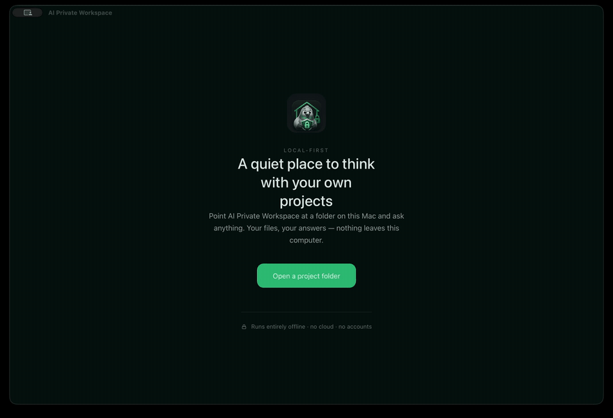

<p align="center">
  
</p>

<h1 align="center">AI Private Workspace</h1>

<p align="center"><b>Ask questions about a folder of files, and get answers that point at the files.</b><br>
Code, documents, an exported wiki — anything you've been handed and don't know yet.<br>
It runs on your own computer. Nothing is uploaded, and no account is needed.</p>

<p align="center">
  <a href="https://github.com/tonkonozhenko-mi/ai_private_workspace/releases/latest"></a>
  <a href="https://github.com/tonkonozhenko-mi/ai_private_workspace/releases"></a>
  <a href="https://github.com/tonkonozhenko-mi/ai_private_workspace/actions/workflows/ci.yml"></a>
  <a href="#install-it"></a>
  <a href="#what-it-will-and-wont-do"></a>
</p>

<p align="center">
  <a href="https://www.bestpractices.dev/projects/13357"></a>
  <a href="https://scorecard.dev/viewer/?uri=github.com/tonkonozhenko-mi/ai_private_workspace"></a>
  <a href="https://www.codefactor.io/repository/github/tonkonozhenko-mi/ai_private_workspace"></a>
  <a href="https://api.reuse.software/info/github.com/tonkonozhenko-mi/ai_private_workspace"></a>
  <a href="LICENSE"></a>
</p>

<p align="center">
  <a href="https://github.com/tonkonozhenko-mi/ai_private_workspace/releases/latest"><b>⬇️ Download for macOS (Apple Silicon / Intel) and Windows x64</b></a>
</p>

<p align="center">
  
</p>

<p align="center"><sub>A real recording: pick a folder, let it read, ask a question, get an answer with the files it came from. About 35 seconds, no internet.</sub></p>

## The problem

You've been handed something you didn't write. A repository. A folder of
documents. A 200-page Confluence export from someone who left. You're expected to be
useful with it this week, and the only honest way in is to read all of it — and
there is too much of it to read.

You could paste it into a cloud AI, except you often can't: it's a client's, or
it's under NDA, or your company simply says no.

So this app reads it instead, on your machine, and answers questions about it.

## How it works

You point it at a folder. It reads what's inside and builds a private index —
that's a few minutes, once. Then you ask questions in your own words, and each
answer comes back with the files it was taken from, so you can check it.

And when the answer isn't in your files, **it says so instead of making
something up.**

## What you can ask it

- *"How does this get deployed, and to which environments?"*
- *"Where is the orders table defined, and who reads from it?"*
- *"What did we decide about storage, and where is that actually implemented?"*
- *"What changed since I last looked at this?"*

The last two are worth a note. You can put several folders into one **group** —
say, the wiki and the repository it describes — and ask across them together.
The answer then carries the decision from the wiki and the implementation from
the code, each labelled with where it came from.

## Install it

1. **[Download it](https://github.com/tonkonozhenko-mi/ai_private_workspace/releases/latest)** and open it. On macOS, drag it to Applications.
2. **Point it at a folder.** It asks who you are on this project — developer,
   DevOps, tester, manager, business analyst, DBA. That only changes what it shows you
   first; it never changes what's true.
3. **Choose which local AI runs it.** The app ships with one — llama.cpp —
   and needs nothing installed. If you already use Ollama, point it there
   instead. Either way it downloads two small models once, a few gigabytes:
   one to write answers, one to search your files. After that, no internet.
4. **Run the scan, then click Build context.** The scan lists what's in the
   folder; Build context is what makes it searchable. Then ask your first
   question.

Step-by-step with screenshots:
[`docs/INSTALL_WALKTHROUGH.md`](docs/INSTALL_WALKTHROUGH.md).

<details>
<summary><b>First launch shows a scary warning — here's why, and what to do</b></summary>

The app is not signed with a paid developer certificate. Certificates cost money
per year, and this project doesn't have that yet. Both operating systems treat
any unsigned download the same way, so you get their standard warning. It is
about the missing certificate, not about the app.

**Windows.** SmartScreen says "Windows protected your PC." Click **More info →
Run anyway**.

**macOS.** It may say the app "is damaged and can't be opened." It isn't
damaged — that is what macOS says about unsigned downloads. Drag it to
**Applications**, run this once in Terminal, then open it normally:

```bash
xattr -cr "/Applications/AI Private Workspace.app"
```

That command removes the "downloaded from the internet" mark macOS puts on the
file; it changes nothing inside the app.

On a work laptop managed by your IT department (MDM), this may be blocked by
policy. There the app would need to be signed and notarized, or installed for
you by IT.

If that trade doesn't sit right with you, that's reasonable. Everything here is
open source — you can read it, and build it yourself.
</details>

## What it can read

Real projects aren't only code. It reads Word documents, PDFs, spreadsheets,
slide decks, exported wiki pages, notebooks, CSV files, diagrams, and source
code in 30+ languages, along with the configuration files a project is
held together by.

It also tells you what it *couldn't* read. If your project has files in a format
it doesn't know yet, it says so plainly — "14 files I can't read yet: .bicep
×12, .ps1 ×2" — rather than quietly leaving them out and letting you believe it
saw everything.

<details>
<summary><b>The full list of formats</b></summary>

| Kind | How it's read | Extensions |
| --- | --- | --- |
| Documents | as text, section by section | `.docx` · `.pdf` · `.html` `.htm` · `.md` `.rst` `.txt` |
| Spreadsheets | sheet by sheet, cell values | `.xlsx` |
| Slide decks | one section per slide | `.pptx` |
| Diagrams | the labels on the boxes and arrows | `.drawio` |
| Tables | rows, with the header repeated so each piece makes sense alone | `.csv` · `.tsv` |
| Notebooks | cell by cell, with cell numbers | `.ipynb` |
| Code | 30+ languages (TypeScript, Go, Rust, Java, Scala, C/C++, C#, Python, Ruby, PHP, Swift, Kotlin, Bicep, PowerShell…) | see [`source_files.py`](backend/app/core/domain/source_files.py) |
| Infrastructure & config | Terraform (`.tf` `.hcl`), Kubernetes and CI files, `Dockerfile`, `Makefile`, SQL, and config in `.yaml` `.yml` · `.json` · `.toml` `.ini` `.cfg` · `.xml` |  |

**Pictures are noticed but not read.** A screenshot of an architecture diagram
has no text in it that a program can read without OCR, so the app tells you the
picture exists and which page it belongs to, rather than pretending to have
understood it.

Old `.doc`, `.xls` and `.vsdx` are not supported. Documents up to 20 MB; other
files up to 2 MB. The index is only built when you ask for it. If the folder is
a code project, the app obeys its `.gitignore` — the list of things that project
already considers junk — so virtualenvs, build output, caches and `.env` secrets
stay out. If there is no such file, nothing is skipped on that account.
</details>

## Understanding it, not just searching it

Answering questions is half of it. The other half is that the app builds a
**map** of the project before you ask anything — and the map is made of facts
read out of your files, not sentences written by a model. Every line on it names
the file it came from, and you can open that file.

This is what turns "search my documents" into "understand what I've inherited".

**It starts from who you are.** A tester, a DevOps engineer and a manager
inherit the same folder and need different things first. You say which you are,
and the dashboard leads with that. It changes the order, never the facts — and
every fact carries the question it raises, so one click asks it.

**What the map can show you:**

- **How it reaches production** — the path from a commit to a running system,
  and what runs when: which pipelines trigger on what.
- **How the environments differ** — dev against staging against production, side
  by side, so the one setting nobody remembers changing is visible.
- **Where the risky places are** — in plain sentences, each with the file that
  makes it a risk, not a severity badge with nothing behind it.
- **What the code is made of** — services, modules, dependencies, database
  tables and who reads from them, drawn as a map you can click through. Click a
  file and it tells you what else breaks if you change it.
- **Who has been working where** — activity from the project's own history:
  where the churn is, which files keep changing together, who knows which part.
- **What changed since you last looked** — a dated journal, so coming back after
  two weeks starts with a summary instead of a diff.

**Several projects at once.** Put the wiki and the repository it describes into
one **group** and the map covers both — environments compared across
repositories in one matrix, risks grouped by pattern rather than repeated per
project. Which is where "what did we decide, and where is it implemented?"
finally has one answer instead of two half-answers.

**When a question is too hard for one pass**, the investigator takes it: a
bounded agent with read-only tools that works step by step and shows each step
as it happens. You watch it reason instead of waiting for a verdict you can't
audit.

**And you can correct it.** If it has the wrong idea about your project, tell
it; it remembers — in a list you can read, edit and delete, stored on your
machine. Nothing is retrained, nothing is uploaded.

The full tour, screen by screen:
[`docs/PROJECT_INTELLIGENCE.md`](docs/PROJECT_INTELLIGENCE.md).

## Small things that add up

A search box (Cmd/Ctrl-K) that jumps to any project, section or file. Starter
questions built from your own project's map, so the first click already asks
something worth asking. And if an answer should become a file, Ask will draft
it — showing you the path and the content, and writing nothing until you agree.

## What it will and won't do

**It doesn't send your files anywhere.** No cloud, no account, no telemetry.
After the one-time model download it works with no internet at all. This is why
it exists: so that work under NDA, or a client's code, can be understood without
uploading it to anyone.

**It doesn't change your project.** It reads. It does not edit your files, and
it does not run commands on your project on its own. If you ask it to write
something, it shows you the file and where it would go, and waits for you to
agree — nothing is written before that.

**It won't quietly start doing things.** Opening the app doesn't begin reading,
indexing or downloading anything. Those start when you click them.

**It shows its work.** Every answer lists its sources, and a deterministic
check — ordinary code, not the model marking its own homework — looks for claims
those sources don't actually support. When it finds
one, it says so in the interface rather than hiding it.

**Your data is one folder on your disk.** Settings → *Where everything is kept*
opens it. Backing up means copying that folder; there's nothing to export.

<details>
<summary><b>The same guarantees, stated precisely</b></summary>

- The interface can never execute shell commands.
- Launching the app never starts a scan, an index build, a rebuild, or a model
  download.
- Executing a model download is disabled by default and can only be enabled
  backend-side, in a trusted local runtime.
- Project analysis is read-only: it never runs commands and never modifies files.
- Ask never writes a generated file by itself; you create it explicitly from the
  review panel.
- Runtime data, local databases, caches and build artifacts are excluded from
  source archives.
</details>

## Does it actually work?

Measured, not promised. The test is a comparison of the same two small local
models against themselves.
First as plain local RAG — a language model plus vector search, which is what
most "chat with your files" tools are. Then through this app: hybrid search, a
refusal threshold calibrated per project, machine-generated code filtered out,
superseded decisions handled as superseded, and a self-correction pass over
every answer. Same models, same computer, same questions —
which were written **before** the first run, so they couldn't be tuned to
flatter the result.

Four real projects, none of them ours: the
[AWS networking module](https://github.com/terraform-aws-modules/terraform-aws-vpc)
that thousands of teams deploy, [Google's Kubernetes
demo](https://github.com/GoogleCloudPlatform/microservices-demo)
of 11 services in 5 languages, the [official FastAPI
starter](https://github.com/fastapi/full-stack-fastapi-template),
and a company knowledge base with decision records — that last one generated,
because the real ones are under NDA, which is rather the situation this app is for.

| | The ordinary way | This app |
|---|---:|---:|
| **Answers pointing at the right file** | 70% | **86%** |
| **Off-topic questions honestly refused** — "what's a good borscht recipe?" must not get an answer "from" a Terraform module | 0 of 12 | **12 of 12** |
| **Answers still containing unsupported claims** | 8–36%, with nothing to catch them | **0%**<sup>1</sup> |

<sub>¹ The published v2 run measured 9% on the wiki project; the fixes it
prompted brought it to 0% at `--repeats 3`. The whole chain is in
[BENCHMARKS](docs/BENCHMARKS.md#results-v2-2026-07-14) — including the two occasions where this
benchmark caught bugs in our own tooling, which are documented rather than
quietly corrected.</sub>

<details>
<summary><b>Per-project numbers, speed, and how to reproduce any of it</b></summary>

Each cell reads: ordinary way → this app.

| Project | Right file cited | Off-topic refused | Unsupported claims |
|---|---:|---:|---:|
| terraform-aws-vpc | 67% → **89%** | 0% → **100%** | 10% → **0%** |
| microservices-demo | 56% → 56% | 0% → **100%** | 9% → **0%** |
| full-stack-fastapi-template | 60% → **100%** | 0% → **100%** | 8% → **0%** |
| wiki-export | 100% → 100% | 0% → **100%** | 36% → **0%**<sup>1</sup> |

The benchmark runs on both engines, each with the model it ships with on the
test machine (qwen3:4b on Ollama, Mistral 7B on the built-in engine). Every
quality number agreed digit for digit on both — searching your files doesn't
depend on which model writes the answer. Speed does (seconds per answer,
Terraform project, ordinary laptop):

| Engine | typical answer | slowest answer |
|---|---:|---:|
| built-in llama.cpp | **25.5 s** | **43.2 s** |
| Ollama | 41.3 s | 126.2 s |

On its own source code, a 40-question suite holds 95% correct-file citations,
100% off-topic refusal, and 3.3% → **0%** unsupported claims after the
self-correction pass.

Reproduce any row from this repository: `python -m eval.golden --embedder nomic
--set <project> --with-generation [--baseline]`, run from `backend/`. Protocol,
dates and commit pins: [`docs/BENCHMARKS.md`](docs/BENCHMARKS.md).
</details>

## How it avoids making things up

Four mechanisms, none of which rely on asking the model nicely.

- **It knows when it doesn't know.** Before answering, it checks how well your
  files actually match the question, against a bar calibrated for your specific
  project. Below the bar, it says it doesn't know instead of guessing.
- **Chit-chat doesn't touch your files.** "Hello" isn't a question about your
  project, and answering it doesn't drag in three random documents.
- **Every answer is checked after it's written**, by ordinary code rather than
  by asking the model to grade itself. The check is deterministic: it looks for
  claims with nothing behind them in the sources. If it finds any, it searches again and
  rewrites once — and keeps the new answer only if it is measurably better
  grounded. Otherwise you see the warning.
- **It works out what fits before it sends.** A local model can only hold so
  much text at once. Room for the answer is set aside first, then your question
  and what it remembers about the project, and the rest is filled with the
  pieces of your files it found. Other alphabets are counted properly, too:
  Ukrainian and Russian take about twice the room English does, and assuming
  otherwise used to mean sending half of what it thought it was sending.

<details>
<summary><b>Under the hood: how the search actually works</b></summary>

Hybrid retrieval, running entirely on your machine: dense vector search for
meaning, BM25 keyword search (SQLite FTS5) over chunk text *and* file paths so
exact identifiers still land, a domain-synonym bridge (asking about
"Content-Security-Policy" finds the file that spells it `csp`), Reciprocal Rank
Fusion to merge the rankings, a path/environment boost so `dev`-specific
questions reach `dev` files, a per-file cap so one file can't fill the whole
answer, and an optional cross-encoder reranker ("Sharper search"). If keyword
indexing is unavailable it degrades to vector-only rather than failing.

The relevance bar is calibrated per index against the embedding model's own
similarity noise floor, so it adapts to the project rather than being a constant
someone guessed. A small enough project skips retrieval entirely and is read
whole.

Prompts are budgeted in tokens against the model's real context window: 768
tokens are held back for the answer and 900 for the standing instructions, while
memory, history and the question are counted at their true size and the
retrieved chunks take what remains. Token counting is script-aware. The full
breakdown, and why there are no per-category percentages, is in
[`docs/ARCHITECTURE.md`](docs/ARCHITECTURE.md#context-budget).
</details>

## The two engines

The app needs a local AI model to write answers, and there are two ways to run
one. Both give you the same setup flow, the same model manager, the same answer
metrics and the same memory indicator — the choice is about where the model
comes from.

**llama.cpp, built in.** Nothing to install; it ships with the app. You can add
other models by pasting a Hugging Face repository that publishes **GGUF** files
(the format local models are distributed in) under **Models → Add a model** —
the app picks a quantization that suits your machine, downloads it, and switches
over. You can also import a `.gguf` file you already have.

**Your own Ollama.** If you already run Ollama, point the app at it and keep the
models you have pulled; they show up as detected installs.

The model that *writes answers* and the model that *searches your files* are
managed separately. Changing the search model means the index has to be rebuilt,
and the app will tell you so rather than quietly returning worse answers.

<details>
<summary><b>Why the built-in engine is the faster one</b></summary>

Running `llama-server` ourselves rather than through another process lets the
app use Flash Attention, keep a warm prompt-prefix cache between questions,
constrain output to a JSON Schema where the answer has to be structured, and ask
the engine for exact token counts instead of estimating them. The speed table
above is the visible result of those four.
</details>

## When something goes wrong

**"Windows protected your PC" / "the app is damaged."** That's the missing
certificate — see [First launch](#install-it) above.

**It won't start**, or says "backend startup failed". The logs are here, and attaching them to a bug report helps:
macOS `~/Library/Application Support/AI Private Workspace/logs/`, Windows
`%LOCALAPPDATA%\AI Private Workspace\logs\`.

**Which engine should I choose?** The built-in one, unless you already use
Ollama. You can switch per project up until the index is built.

**The answers ignore my files.** The folder was scanned but not indexed yet —
click **Build context**. Answers only draw on your files once that exists.

## Where the project stands

Pre-1.0 and actively developed; usable day to day on both engines. Every tagged
release is built by CI into macOS DMGs (Apple Silicon and Intel) and a Windows
x64 installer, with in-app auto-update, and publishes **SHA256 checksums**, an
**SPDX software bill of materials**, and an automated-test report — so you can
verify what you downloaded. The backend is covered by a deterministic suite of
1,000+ tests, run on every push.

The road to 1.0 is mainly code signing and broader testing.

[Roadmap](docs/ROADMAP.md) · [Start here](docs/START_HERE.md) · [Architecture](docs/ARCHITECTURE.md) · [Road to v1](docs/V1_PRODUCT_COMPLETION_ROADMAP.md)

## For developers

```text
backend/     FastAPI backend, domain services, adapters, tests
frontend/    React/Vite UI
docs/        product, architecture, release, and packaging docs
scripts/     local runtime, audit, packaging, and release helper scripts
assets/      brand assets (app icons, logos)
.github/     CI workflows and contribution templates
```

Setup, validation commands and source-hygiene rules:
[`docs/DEVELOPMENT.md`](docs/DEVELOPMENT.md).

Contributions are welcome — [CONTRIBUTING.md](CONTRIBUTING.md) has the product
principles and the development flow. Security issues should go through
[SECURITY.md](SECURITY.md): please report them privately rather than opening a
public issue.

## License

[Apache 2.0](LICENSE). Use it, change it, ship it — including inside a company.
Apache-2.0 was chosen specifically so that adopting this needs no legal
conversation.
