<p align="center">
  
</p>

# AI Private Workspace

[](https://github.com/tonkonozhenko-mi/ai_private_workspace/releases/latest)
[](https://github.com/tonkonozhenko-mi/ai_private_workspace/releases)
[](https://github.com/tonkonozhenko-mi/ai_private_workspace/actions/workflows/ci.yml)
[](LICENSE)
[](#install-and-first-run)
[](#safety-model)

**AI Private Workspace** is a local-first desktop app (macOS and Windows) for
understanding your own projects. Point it at a folder and ask anything — about
your code, infrastructure, CI/CD, or docs. **It reads, explains, and helps you
understand; it does not change your project.** Once the local model is downloaded
it runs fully offline and grounds every answer in your real files. Nothing leaves
your computer.

### ⬇️ [Download the latest release](https://github.com/tonkonozhenko-mi/ai_private_workspace/releases/latest)

macOS (Apple Silicon / Intel) and Windows x64 installers are on the
[releases page](https://github.com/tonkonozhenko-mi/ai_private_workspace/releases/latest).

> This README and [CHANGELOG](CHANGELOG.md) track the `main` branch, which is
> usually ahead of the latest tagged release. For a stable build, download from
> the releases page; to try the newest work, build from source.

<p align="center">
  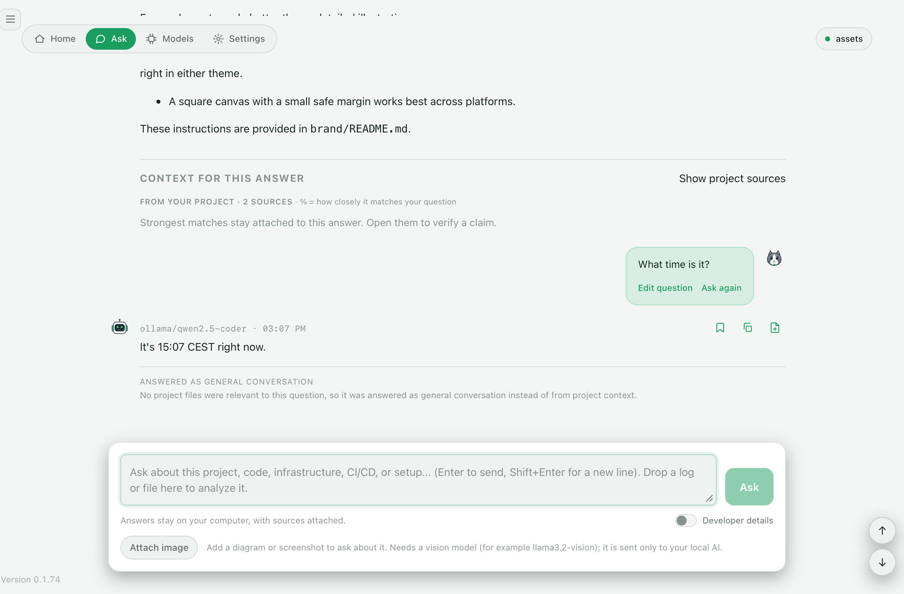
</p>

## Contents

- [First launch (unsigned app)](#first-launch-unsigned-app)
- [Install and first run](#install-and-first-run)
- [What it does](#what-it-does)
- [Project intelligence and read-only analysis](#project-intelligence-and-read-only-analysis)
- [Local engines](#local-engines)
- [How search works](#how-search-works)
- [Safety model](#safety-model)
- [Main product flows](#main-product-flows)
- [Troubleshooting](#troubleshooting)
- [Current status](#current-status)
- [Repository layout](#repository-layout)
- [Developer startup](#developer-startup)
- [Validation](#validation)
- [Contributing](#contributing)
- [License](#license)

## First launch (unsigned app)

The app isn't code-signed with a paid certificate yet, so both systems show a
one-time warning for unsigned downloaded apps. It's the standard prompt, not a
problem with the app.

**Windows.** SmartScreen may say "Windows protected your PC." Click **More info →
Run anyway**.

**macOS.** It may say the app "is damaged and can't be opened." It is not
damaged — macOS just blocks unsigned downloaded apps. After dragging it into
**Applications**, run this once in Terminal, then open it normally:

```bash
xattr -cr "/Applications/AI Private Workspace.app"
```

On a managed/work machine (configuration profile / MDM), this may be blocked by
IT policy; there the app needs to be signed/notarized or deployed through your
organization's device management.

## Install and first run

From the download to your first answer — eight steps, every one of them on your
own Mac (no cloud, no accounts):

<table>
  <tr>
    <td width="50%">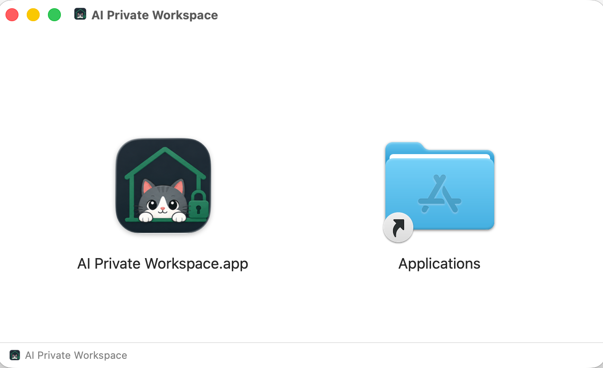<br><sub><b>1 · Install</b> — open the downloaded <code>.dmg</code> and drag <b>AI Private Workspace</b> into <b>Applications</b>.</sub></td>
    <td width="50%">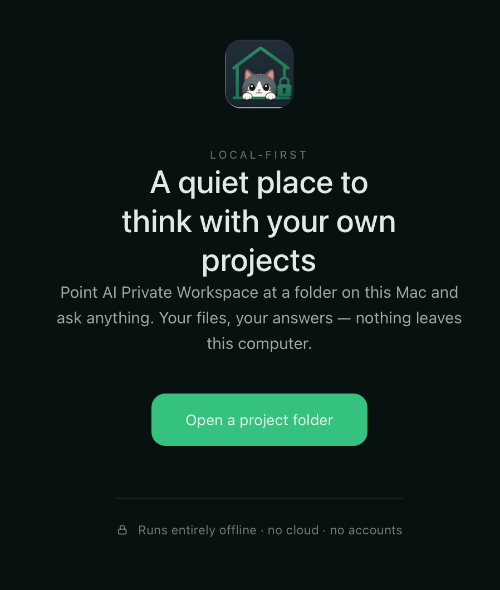<br><sub><b>2 · Welcome</b> — launch it and click <b>Open a project folder</b>. Your files stay on your computer.</sub></td>
  </tr>
  <tr>
    <td width="50%">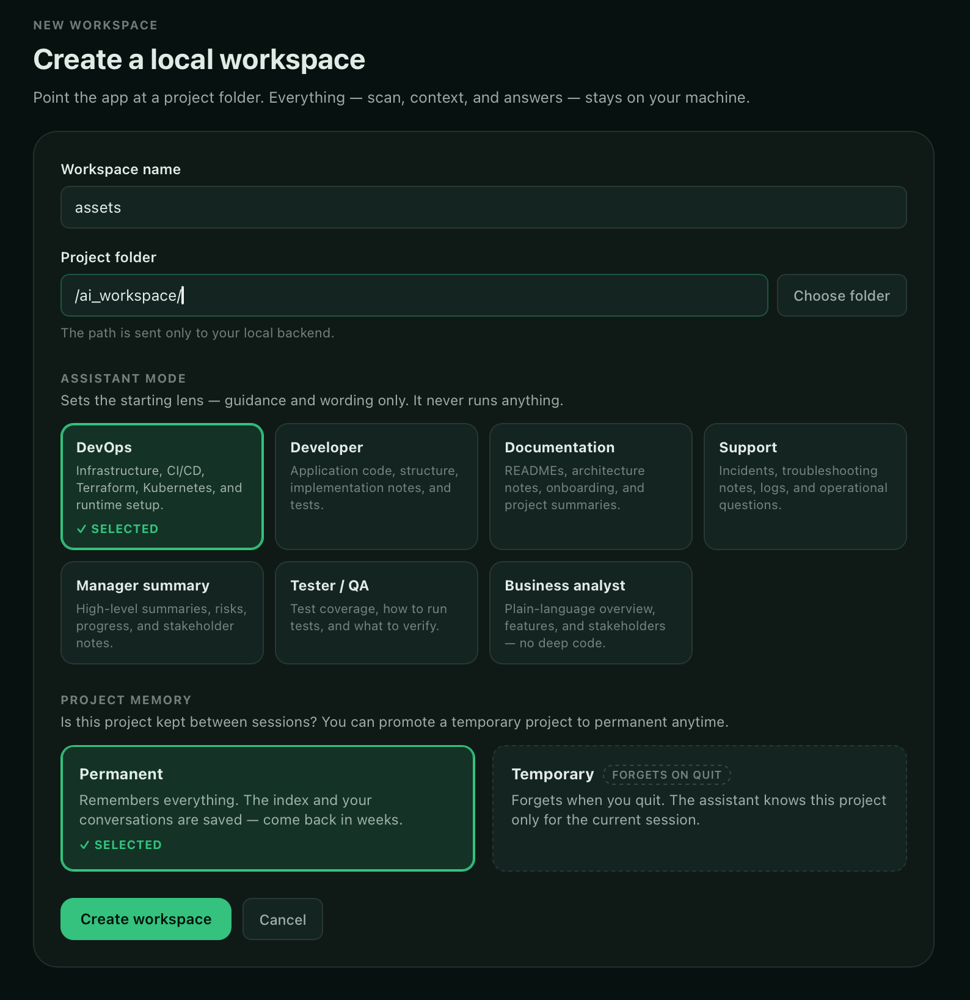<br><sub><b>3 · Create a workspace</b> — name it, pick the folder, choose a role lens (DevOps, Developer, Tester, BA…) and whether the project is remembered.</sub></td>
    <td width="50%">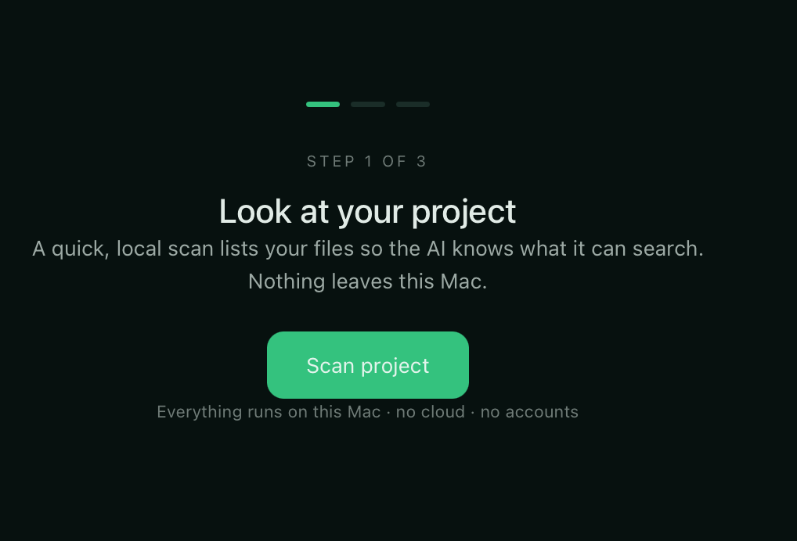<br><sub><b>4 · Scan</b> — a quick local pass lists your files so the AI knows what it can search. Nothing leaves the Mac.</sub></td>
  </tr>
  <tr>
    <td width="50%">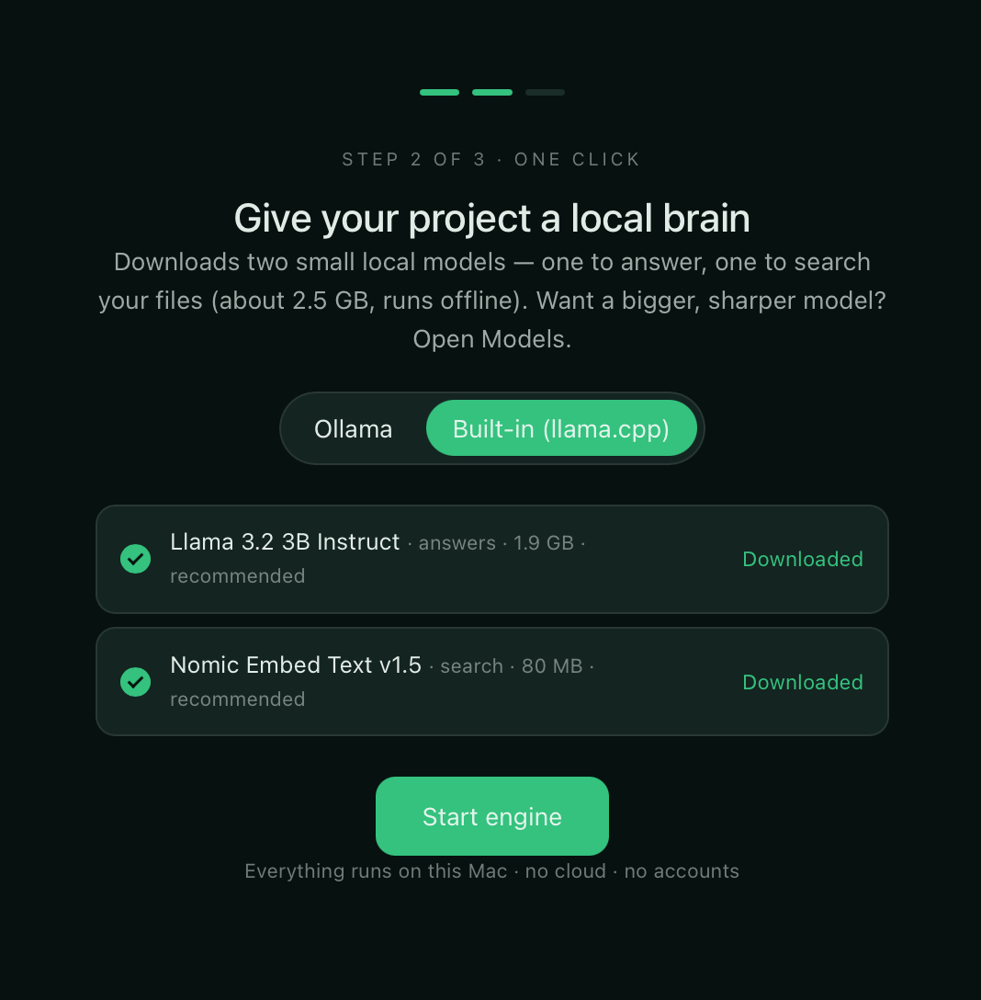<br><sub><b>5 · Choose an engine</b> — built-in <b>llama.cpp</b> (nothing to install) or <b>Ollama</b>. Downloads two small local models (answer + search), then <b>Start engine</b>.</sub></td>
    <td width="50%">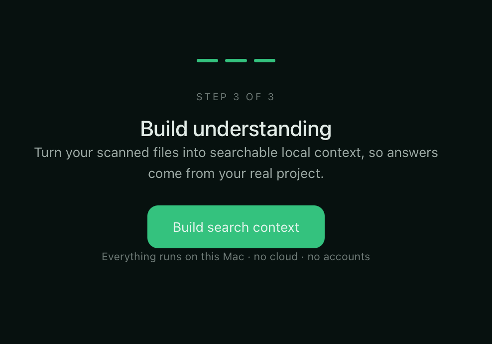<br><sub><b>6 · Build context</b> — turn the scanned files into a searchable local index so answers come from your real project.</sub></td>
  </tr>
  <tr>
    <td width="50%">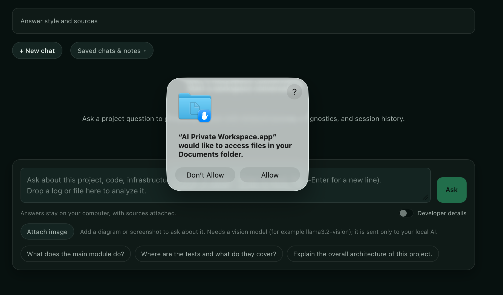<br><sub><b>7 · Grant folder access</b> — macOS asks once before the app reads your folder. Click <b>Allow</b>.</sub></td>
    <td width="50%">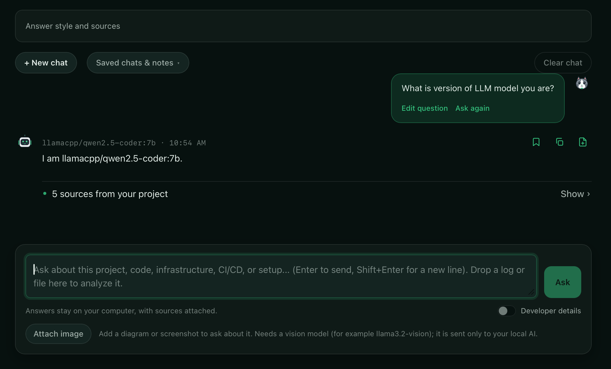<br><sub><b>8 · Ask</b> — ask about your code, infra, CI/CD, or setup. Answers cite sources from your project and stay on your computer.</sub></td>
  </tr>
</table>

The app also follows your system light/dark preference:

<p align="center">
  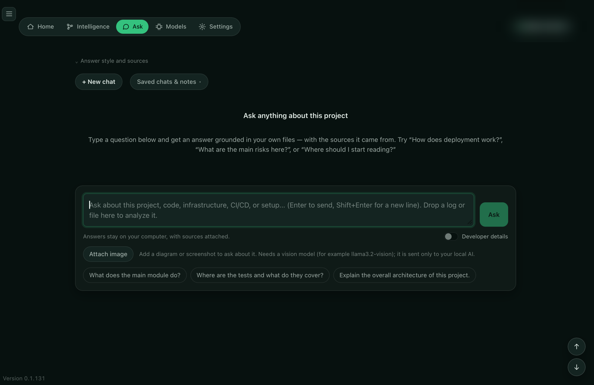
</p>

## A few more screens

<table>
  <tr>
    <td width="50%">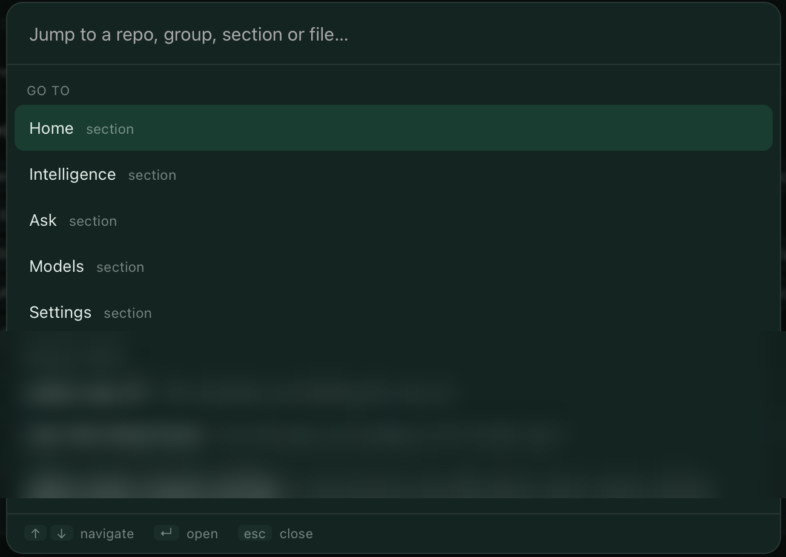<br><sub><b>Command palette</b> — <code>Cmd/Ctrl-K</code> to jump to any repository, group, section, or file.</sub></td>
    <td width="50%">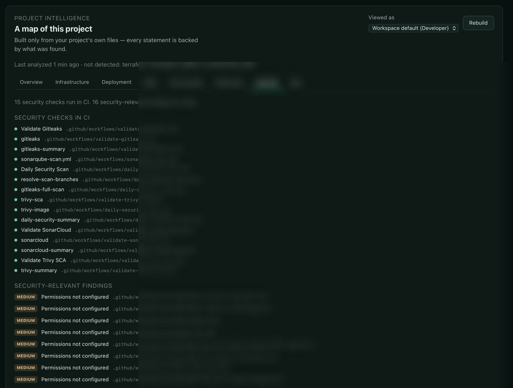<br><sub><b>Security lens</b> — which scan/audit steps run in CI, plus the security-relevant findings, each backed by a file.</sub></td>
  </tr>
</table>

> Screenshots are taken on a demo project and any project names, file paths, and contributor details are redacted.

## What it does

- **Understands your project.** Point it at a folder; a local scan recognizes what's there — Terraform, Terragrunt, Kubernetes, Helm, Docker, Python, GitLab CI, docs, and more.
- **Searches only when you ask.** The local index is built on an explicit action and respects your `.gitignore`, so virtualenvs, build output, caches, and `.env` secrets never enter it.
- **Answers from your files.** Responses are grounded in retrieved sources with citations — not guesses — and your conversations, history, model choices, and reports stay on your computer.
- **Groups several repositories into one project.** Real systems span more than one repo. A group lets Ask, Home, and Intelligence work across a whole portfolio at once — environments compared in a repo×environment matrix, technologies split into shared-vs-unique, and risks grouped by pattern — while each repo stays an independent workspace underneath.
- **Built to navigate.** A **Cmd/Ctrl-K command palette** jumps to any repository, group, section, or file. Click a file anywhere and a **file inspector** opens its owner, what it changes together with, what it connects to in the map, and the risks touching it.
- **Runs on two local engines.** Built-in **llama.cpp** (nothing to install) or **Ollama**, switchable per project, with the answer and search models managed separately. See [Local engines](#local-engines).
- **Writes nothing without consent.** Ask can turn an answer into a file draft, written only after you confirm the path and exact content. Nothing else runs on its own — the app reads and explains, it never executes commands or changes your machine.

## Project intelligence and read-only analysis

Beyond search, the app builds a **map of your project** and gives you two local
analysis tools that work over it. The guiding principle is the same throughout:
every statement is backed by something found in your own files, the facts are
produced deterministically wherever possible, and the analysis is **read-only by
construction** — it looks and explains, but it never writes files, runs commands,
or changes anything on your computer.

### Project Intelligence — the map

On an explicit action, the app assembles a **role-neutral evidence graph** from
deterministic analyzers (Terraform, Terragrunt, GitLab CI, GitHub Actions,
Kubernetes, Helm, and Python). The result is a set of honest, source-linked views:
a summary, infrastructure, deployment flow, environments, risks, a **Cloud** tab
listing the AWS / Google Cloud / Azure services your IaC provisions, a
**References** tab (URLs, module sources, ARNs), and an interactive **Map**.

A **role lens** (Developer, DevOps, Tester, Business analyst) turns the same facts
into an **adaptive dashboard** for who's looking — a role-framed brief that leads
with the facts that matter to that role (environments, pipelines, modules…), the
risks worth its attention, and a row of suggested questions you can click straight
into Ask. It re-orders and re-frames; it never changes the facts. Inferred facts
(for example, an environment guessed from a directory name) are always labelled as
inferred. The only LLM-written pieces — a plain-language overview and the "ask the
graph" answer — are constrained strictly to the graph's facts.

### CI/CD flow

A visual **CI/CD flow** lays out the pipelines as they actually fire: each trigger
(push to a feature branch, push to the default branch, pull request, tag/release,
schedule, manual) flows into the workflows it runs and the jobs inside them, with
schedules and the workflow file one click from the inspector. Security/scan jobs
are flagged, and the environments the project defines are listed alongside.
Everything is read straight from the project's own workflow files.

### Project activity & change coupling — read from git

A read-only pass over the repository's **own git history** (no model) becomes a
readable briefing: how active the project is, who knows which parts of the code
(the right people to ask), how it ships (branch strategy, long-lived branches,
merge flow), and the files where work concentrates. It also surfaces **change
coupling** — pairs of files that keep changing together in the same commits;
cross-module pairs are flagged as a likely hidden dependency the import graph
misses. Like the map, the card re-frames itself for the role you chose.

### File inspector

Open any file — from search, the "where to start" lists, or the hotspots — for a
read-only lens on it: its owner and recent changes (from git), what it changes
together with, what it connects to in the project map (its blast radius — what it
depends on and what it affects), and which risks touch it. All composed from data
the app already computed.

### Security lens

A read-only **Security** view reports what security gates already exist and where
the gaps are: which scan/audit steps run in CI (secret, dependency, and IaC
scanning) and which deterministic findings are security-relevant — permissions,
secrets, public exposure, encryption, IAM/access — each with a recommendation and
the file it came from. It reports on scanners; it never runs one.

Every finding — here and in the **Risks** tab — reads as a lead for a human, not a
verdict: what was found, **why it may matter**, where (one click to the inspector),
how confident we are in plain language, and **what to check yourself**, with the
recommendation framed as an idea to review rather than a fix to auto-apply. The
language is deliberately "needs review", to inform rather than alarm.

### Project groups — several repositories as one project

A **group** treats a set of repositories as a single project. Ask once and the
answer is drawn from every member (each source labelled with the repo it came
from); a portfolio Home rolls up each repo's activity; and group Intelligence
**compares rather than merges** — environments in a repo×environment matrix,
technologies split into common / shared / unique, and risks grouped by pattern
with a per-repo breakdown. Create a group by dragging one project onto another;
member repositories stay independent workspaces underneath.

### The Watcher — deterministic change tracking

The Watcher answers **"what changed since I last looked?"** On demand it
re-scans the project, rebuilds the graph, and **diffs it against the previous
snapshot** — reporting new environments, newly detected technologies, new and
resolved risks, new cloud services, and more. The facts come entirely from
comparing two graphs (no model needed); the digest is persisted so it survives
restarts. It is the foundation for scheduled, hands-off drift detection.

### The Investigator — read-only, evidence-backed analysis

The Investigator answers harder, multi-step questions — _"How does a request
reach the database?"_, _"Who should I ask about this module?"_ — by running a
small **ReAct loop**: at each step the local model picks **one read-only tool**,
reads the result, and decides what to do next, until it can answer.

There is deliberately **one** investigator, not a swarm of narrow tools. Adding a
new capability means giving it another read-only tool, which widens what it can
reason about — the investigator decides which tools to combine for a given
question. Its toolbox is intentionally small and safe:

| Tool | What it does |
| --- | --- |
| `search_code` | semantic search over the indexed code and docs |
| `read_file` | read a project file's contents |
| `graph_query` | look up entities and relations in the project map |
| `list_files` | list project files matching a substring |
| `git_history` | who changed a file, and its recent commits |
| `ci_triggers` | what CI runs on push / pull request / tag / schedule |

The loop is built for **local models**: the protocol is plain text the app parses
itself (`ACTION: <tool>: <input>` … `FINAL: <answer>`), with validation, a couple
of retries on malformed replies, a step budget, and a graceful "out of steps"
fallback rather than a guess. Every answer comes with a **transparent trace**
(each tool call, its input, and what it returned) and the **sources consulted**,
collected deterministically — so the answer is always backed by real evidence,
even if the model forgets to cite.

**What it can reason about**

Through those tools the Investigator draws on the indexed code and docs, the
project map (infrastructure, services, environments, pipelines, cloud services,
risks), individual files, the git history and file ownership, and CI trigger
behaviour. It is strongest on understanding-and-orientation questions, not on
predicting runtime behaviour it can't see in the files.

**Questions it answers well**

- _Architecture & code_ — "How does a request reach the database?", "Which
  modules depend on the billing module?", "Where is authentication handled?"
- _Infrastructure & deployment_ — "What gets deployed to production?", "Which AWS
  services does this project use?", "What runs in CI when I push to a feature
  branch versus open a pull request?"
- _Ownership & history_ — "Who should I ask about the payments module?", "When did
  this config last change, and why?"
- _Risk & orientation_ — "What are the biggest risks flagged here?", "Where should
  I start reading to understand this repo?"

When the answer isn't in the project's files, it says so plainly rather than
guessing.

**How the analysis stays trustworthy**

- **Read-only by construction** — no analysis tool writes a file or runs a command.
- **Local and private** — everything runs on your machine; your code never leaves it.
- **Evidence-backed** — deterministic facts first; sources attached to every answer.
- **Transparent** — the Investigator shows exactly which tools it used and why.
- **Bounded** — a step budget keeps a run finite; you stay in control.

## Local engines

Everything runs locally — no cloud, no accounts — on whichever engine you prefer,
chosen per project and switchable at any time before indexing:

- **Built-in llama.cpp** — the app bundles `llama-server` and runs GGUF models
  with **nothing to install**. Add any model straight from a Hugging Face repo
  and the app resolves a sensible quant for you. Best for a zero-setup start.
- **Ollama** — if you already use Ollama, point the app at it and keep your
  existing models and tags. Best if you live in the Ollama ecosystem.

Both paths are first-class: the same setup flow, model manager, answer metrics
(real token counts, generation speed, and context-window usage), and a live RAM
indicator work identically. The answer model and the search (embedding) model are
managed separately, so you can mix a strong answer model with a small, fast
embedder.

## How search works

Answers are grounded in your project through a **hybrid retrieval** pipeline —
the same approach used by strong production RAG systems, running fully on your
machine:

- **Dense vector search** — your question and every chunk are embedded; the
  closest chunks by cosine similarity are retrieved. Great for meaning and
  paraphrase, but weak at exact names.
- **Keyword search (BM25)** — a full-text index (SQLite FTS5) over the chunk text
  **and its file path**, so exact identifiers — folder names like `dev`, variable
  names like `<project name>_allowed_cidr` — are matched literally, which pure vector search
  misses.
- **Reciprocal Rank Fusion (RRF)** — merges the vector and keyword rankings
  without having to normalize their very different score scales.
- **Path / environment boost** — chunks whose file-path segments match query
  terms (e.g. `dev`, `<project name>`) are lifted, so environment-specific questions land on
  the file under that path instead of a similarly-worded one elsewhere.
- **Per-file diversity** — one large file can't fill the whole answer, so results
  span more of the codebase.

It degrades gracefully: if keyword indexing is unavailable it falls back to
vector-only search. On the roadmap: a cross-encoder **reranker** for an extra
precision pass.

## How it all connects

The end-to-end flow at a glance:

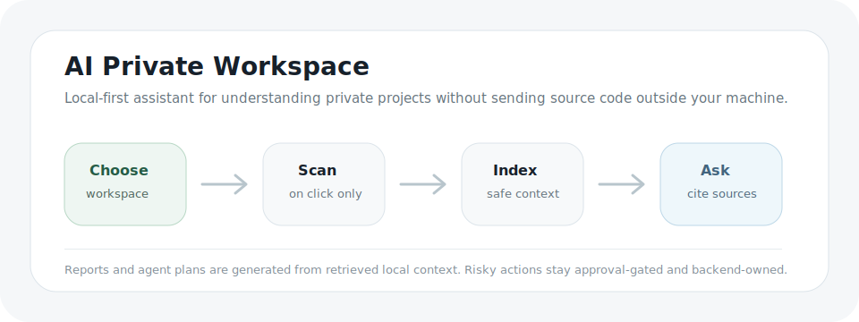

> Capturing the screenshots above? See [`docs/assets/screenshots/CAPTURE_GUIDE.md`](docs/assets/screenshots/CAPTURE_GUIDE.md) for the exact shots and file names.

## Safety model

AI Private Workspace is designed around explicit user control:

- The frontend never executes shell commands.
- App launch never starts scans, indexing, rebuilds, or model downloads.
- Model download execution is disabled by default and must be enabled backend-side in trusted local runtime only.
- The local analysis is read-only — it never executes commands or modifies files.
- Approval gates record user intent; they do not execute anything automatically.
- Ask never writes a generated file automatically. The user must open the review panel and explicitly create it.
- Runtime data, local databases, caches, and build artifacts are excluded from source archives.

## Main product flows

The frontend keeps the common workflows focused and progressively reveals technical detail:

- **Ask** answers from workspace context and can prepare a safe, editable file draft.
- **Models** separates Overview, Choose & install, Skills, Compare, and Advanced configuration.
- **Choose & install** uses backend-provided recommendations and accepts custom
  Ollama model tags. A desktop-owned backend can safely run the exact approved
  `ollama pull <model>` job, while browser development keeps downloads disabled
  unless explicitly configured.
- **Skills** saves workspace model presets, while **Compare** runs explicit model comparisons.
- **Settings** shows a plain-language readiness checklist for the local backend, project scan, search context, and local AI.

## Troubleshooting

**Windows — "Windows protected your PC" (SmartScreen).** The app isn't
code-signed yet, so Windows warns on first launch. Click **More info → Run
anyway**. It's the standard prompt for unsigned apps, not a problem with the app.

**macOS — "AI Private Workspace is damaged and can't be opened".** Not damaged —
macOS blocks unsigned downloaded apps. After dragging it into **Applications**,
run this once in Terminal, then open it normally:

```bash
xattr -cr "/Applications/AI Private Workspace.app"
```

**The app won't start / "backend startup failed".** Check the logs and attach
them to a bug report:

- macOS: `~/Library/Application Support/AI Private Workspace/logs/`
- Windows: `%LOCALAPPDATA%\AI Private Workspace\logs\`

`backend.log` has the engine's own output; `desktop-supervisor.log` shows what the
launcher searched for.

**Which engine should I pick?** Use **built-in llama.cpp** for a zero-setup start
(nothing to install). Choose **Ollama** if you already use it and want your
existing models. You can switch per project before the index is built.

**Answers ignore my files.** Make sure you ran **Build context** after scanning —
answers are grounded only once the local index exists. Changing the embedding
(search) model requires rebuilding the index, since it creates a different vector
space.

## Current status

Pre-1.0 and actively developed. Each tagged release builds from CI into
signed-per-architecture macOS DMGs (Apple Silicon + Intel) and a Windows x64
installer, with in-app auto-update. The app is usable day to day on both local
engines; the road to 1.0 focuses on code signing (so there's no SmartScreen /
Gatekeeper warning) and broader QA.

Every release also publishes **SHA256 checksums** (`SHA256SUMS.txt`), an **SPDX
SBOM** (`sbom.spdx.json`) of the bundled dependencies, and an **automated-test
report** (`TEST-REPORT.md`) of what actually ran — so you can verify what you
download.

The backend is covered by a deterministic test suite (600+ tests over the domain,
use cases, and API), run on every push and pull request. Each CI run renders a
pass/fail summary on its page and attaches the JUnit results, so the test state is
visible at a glance rather than buried in logs.

See:

- [Roadmap](docs/ROADMAP.md)
- [Start here](docs/START_HERE.md)
- [Architecture](docs/ARCHITECTURE.md)
- [v1 product completion roadmap](docs/V1_PRODUCT_COMPLETION_ROADMAP.md)

## Repository layout

```text
backend/     FastAPI backend, domain services, adapters, tests
frontend/    React/Vite UI
docs/        product, architecture, release, and packaging docs
scripts/     local runtime, audit, packaging, and release helper scripts
assets/      brand assets (app icons, logos)
.github/     CI workflows and contribution templates
```

## Developer startup

Backend:

```bash
cd backend
python -m venv .venv
source .venv/bin/activate
pip install -r requirements.txt
uvicorn app.main:app --reload
```

Frontend:

```bash
cd frontend
npm ci
npm run dev
```

For the current macOS developer-safe launcher:

```bash
chmod +x scripts/launch_macos.command scripts/create_macos_shortcut.sh
./scripts/launch_macos.command
```

For the desktop app bundle, double-click `Open AI Private Workspace.command` in
the repository root. It rebuilds the packaged app when tracked application
sources changed since the last successful build, otherwise it opens the
existing app immediately and brings its window to the front.
When an update is detected while the app is already open, the launcher
smoke-checks the new backend on an isolated port, then asks the known app bundle
to close cleanly before opening the updated build. It never force-kills an
unknown process.

If the launcher cannot build or open the app, it keeps the Terminal window open
and points to `build/desktop/open-ai-private-workspace.log`. The packaged app
backend also writes diagnostics to:

```text
~/Library/Application Support/AI Private Workspace/logs/
```

### Use your own models

Bring a different answer model on either engine. It is managed separately from
the search (embedding) model, so you can pair a strong answer model with a small,
fast embedder.

**Ollama** — open **Models → Choose & install**, pick **Custom Ollama model**,
enter the exact tag (e.g. `deepseek-r1:1.5b`), and choose **Use this AI answer
model**. If Ollama already has it, it is marked ready; if not, and the desktop
download worker is enabled, the app runs a narrowly validated `ollama pull`.
Models you pulled yourself in Terminal appear as detected installs, so the app
never claims it downloaded them.

**Built-in llama.cpp** — open **Models** and, under **Add a model**, paste a
Hugging Face **GGUF** repo (e.g. `bartowski/Qwen2.5-0.5B-Instruct-GGUF`). The app
picks a sensible quant for you, downloads it, and switches the engine — no
filename hunting. Your choice persists across restarts.

Changing the embedding (search) model creates a different vector space, so it
always requires an explicit context rebuild.

## Validation

Run the release audit from the repository root:

```bash
./scripts/audit_release_candidate.sh
```

Run focused backend checks:

```bash
cd backend
pytest -q tests/test_final_product_status.py tests/test_product_completion_roadmap.py tests/test_release_candidate_audit.py tests/test_release_candidate_audit_script.py tests/test_source_release_archive_script.py tests/test_api_inventory.py
```

Run frontend validation:

```bash
cd frontend
npm ci
npm run build
```

Create a clean source archive:

```bash
./scripts/prepare_source_release_archive.sh
```

The generated archive is written to `build/release/` and must not be committed.

## Runtime data policy

Do not commit:

- `backend/.ai-workbench/`
- `frontend/node_modules/`
- `frontend/dist/`
- `build/`
- `.pytest_cache/`
- `__pycache__/`
- `*.db`, `*.sqlite`, `*.sqlite3`

## Contributing

Contributions are welcome. Please read [CONTRIBUTING.md](CONTRIBUTING.md) for the
product principles, development flow, and source-hygiene rules before opening a
pull request. Security issues should follow [SECURITY.md](SECURITY.md) — please
report them privately rather than in a public issue.

## License

Licensed under the [Apache License 2.0](LICENSE). You are free to use, modify,
and distribute this software, including in commercial and enterprise settings.
Apache-2.0 was chosen so companies can adopt the product without the legal
friction that more restrictive copyleft licenses introduce.
